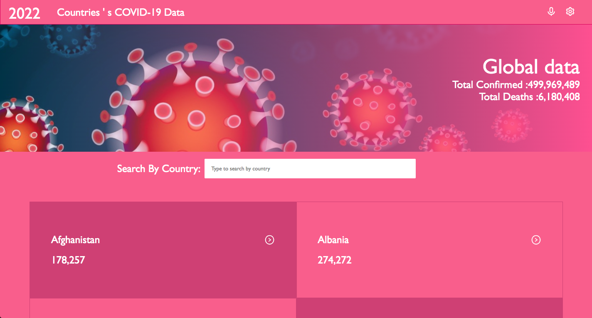

# COVID-19 Data TRACKER

> This is Covid-19 data that shows for each country.You can search your country and know its statistics . 



## Built With

- HTML, CSS, JS
- Bootstrap, SCSS, React, Redux


## Live Demo

- [Live Demo Link](https://6256dc07a9940a275a24dff6--gleeful-chimera-2ff1ba.netlify.app/)

## Available Scripts

In the project directory, you can:

### Run the app in the development mode

- Launch your terminal,
- `cd` into the directory where you want to clone your project,
- Enter the commands below
```
$ git clone git@github.com:damdafayton/group-project-spacehub.git
$ npm install
$ npm start
````
- Open [http://localhost:3000](http://localhost:3000) to view it in your browser.

The page will reload when you make changes.\
You may also see any lint errors in the console.

### Launch the test runner in the interactive watch mode

`npm test`

See the section about [running tests](https://facebook.github.io/create-react-app/docs/running-tests) for more information.

### Build the app for production to the `build` folder

`npm run build`

It correctly bundles React in production mode and optimizes the build for the best performance.

The build is minified and the filenames include the hashes.\
Your app is ready to be deployed!

See the section about [deployment](https://facebook.github.io/create-react-app/docs/deployment) for more information.

### Eject the app

`npm run eject`

**Note: this is a one-way operation. Once you `eject`, you can't go back!**

If you aren't satisfied with the build tool and configuration choices, you can `eject` at any time. This command will remove the single build dependency from your project.

Instead, it will copy all the configuration files and the transitive dependencies (webpack, Babel, ESLint, etc) right into your project so you have full control over them. All of the commands except `eject` will still work, but they will point to the copied scripts so you can tweak them. At this point you're on your own.

You don't have to ever use `eject`. The curated feature set is suitable for small and middle deployments, and you shouldn't feel obligated to use this feature. However we understand that this tool wouldn't be useful if you couldn't customize it when you are ready for it.


## Author

👤 **Dagic-zewdu**

- [Github](https://github.com/Dagic-zewdu)
- [LinkedIn](https://www.linkedin.com/in/dagmawi-zewdu-21b835215/)


## 🤝 Contributing

Contributions, issues, and feature requests are welcome!

Feel free to check the [issues page](../../issues/).


## Show your support

Give a ⭐️ if you like this project!

## Huge Thanks

I give my huge thanks for [Nelson Sakwa on Behance](https://www.behance.net/sakwadesignstudio). For wonderful template on [Behance](https://www.behance.net/gallery/31579789/Ballhead-App-(Free-PSDs)).  
## 📝 License

This project is [MIT](./MIT.md) licensed.
